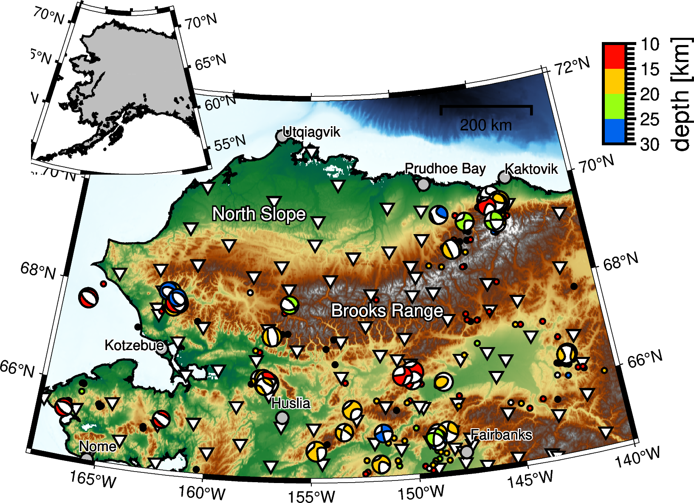

BASED\_ALASKA
==============
Basemaps focused on geophysical studies in Alaska, using PyGMT. 
---------------------
This package features:
+ Pre-designed basemap config parameters that provide a nice default look.
+ Customization through YAML config files, rather than source code edits.
+ Abstracting PyGMT calls behind a cleaner API.
+ A catch-all repository for publication-level figure creation.

A Northern Alaska example

	

