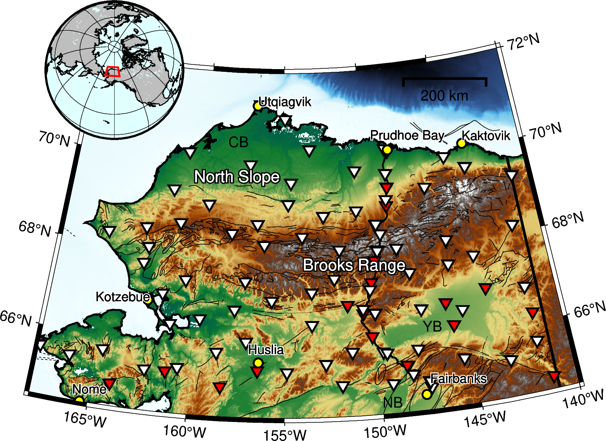

BASED\_ALASKA
==============
### Basemaps focused on geophysical studies in Alaska, using PyGMT. 

This mapping package features:
+ Pre-designed basemap config parameters that provide a nice default look.
+ Customization through YAML config files, rather than source code edits.
+ Abstracting PyGMT calls behind a cleaner API.
+ A catch-all repository for publication-level figure creation.

This package is a work in progress, and will likely see improvements in the coming years. At this stage, the following Northern Alaska example shows what Based\_Alaska is capable of with a single call:

	

